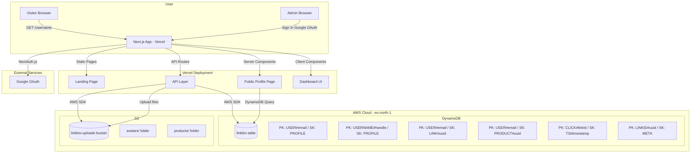

# LinkBio Architecture Diagram

## Data Flow

1. **Visitor** opens `https://linkbio.vercel.app/username`
2. **Next.js Server Component** queries DynamoDB:
   - `USERNAME#handle` → gets userId
   - `USER#userId` → gets profile + theme
   - `USER#userId` + `LINK#` prefix → gets links
   - `USER#userId` + `PRODUCT#` prefix → gets featured products
3. **Page renders** with theme applied, showing avatar, name, bio, featured products, and links
4. **Click on link** → `GET /api/track/linkId` → records click in DynamoDB + redirects to target URL
5. **Admin** signs in with Google → manages links/products in dashboard
6. **File uploads** → sent to `/api/upload` → stored in S3 → URL saved to DynamoDB

## AWS Database Used

**Amazon DynamoDB** - Single-table design with the following access patterns:
- Entity lookup by PK/SK composite key
- Username-to-userId reverse lookup
- All links/products for a user via query with `begins_with`
- Click events recorded with timestamp sort key for time-series analytics
